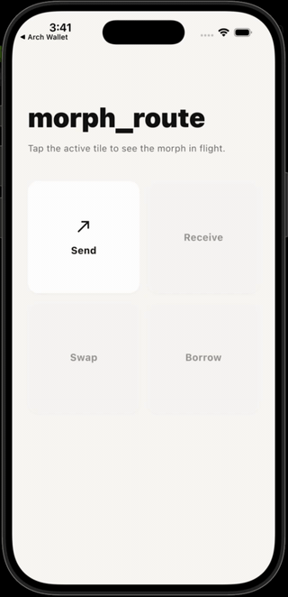

# morph_route

**iOS 26-inspired container morph for Flutter.**

A modified `OpenContainer` plus two helper widgets that make tile-to-screen navigation feel premium: a backdrop-blurred underlying screen, a tunable accent scrim, an iOS 26-style 3D tilt mid-flight, and a scaffold-level recede so the host UI feels like it's stepping back as the new screen flies in.

<p align="center">
  
</p>

## Install

While the package isn't on pub.dev yet, depend on it via `path:`:

```yaml
dependencies:
  morph_route:
    path: ../morph_route
```

Or via git once the repo is public:

```yaml
dependencies:
  morph_route:
    git:
      url: https://github.com/LiquidatorCoder/morph_route
      ref: main
```

## 30-second quickstart

```dart
import 'package:flutter/material.dart';
import 'package:morph_route/morph_route.dart';

class HomePage extends StatelessWidget {
  @override
  Widget build(BuildContext context) {
    return Scaffold(
      // 1. Wrap your body so it scales down behind any active morph route.
      body: MorphRecede(
        child: Center(
          // 2. Use MorphTile in place of a regular button/card.
          child: MorphTile(
            transitionDuration: const Duration(milliseconds: 460),
            reverseTransitionDuration: const Duration(milliseconds: 340),
            closedColor: Colors.white,
            openColor: Colors.white,
            closedShape: RoundedRectangleBorder(
              borderRadius: BorderRadius.circular(16),
            ),
            closedShadows: const [
              BoxShadow(blurRadius: 4, color: Colors.black12),
            ],
            // The premium bits:
            openBlurSigma: 12,
            scrimColor: const Color(0x14D97757), // 8% coral
            peakTiltY: 0.09,                     // ~5° Y rotation mid-flight
            // Press feedback:
            pressedScale: 0.98,
            pressedOverlayColor: Colors.black12,
            onTap: () { /* haptics, analytics */ },
            closedBuilder: (context) => SizedBox(
              width: 160, height: 80,
              child: const Center(child: Text('Open')),
            ),
            openBuilder: (context, _) => const DetailScreen(),
          ),
        ),
      ),
    );
  }
}
```

## API surface

| Widget | What it does |
|---|---|
| **`MorphTile`** | A pressable tile that morphs into a destination route. Combines `OpenContainer` with idiomatic press feedback (subtle scale + tinted overlay). 95% of callers want this. |
| **`MorphRecede`** | Wraps a scaffold body so it scales down (and optionally translates) as a morph route opens, synced to `OpenContainer.activeProgress`. The "stack receding" feel. |
| **`OpenContainer`** | The morph route itself. Use directly when you need finer control than `MorphTile` gives — programmatic open via a controller pattern, custom press feedback, etc. |

Full dartdoc lives next to each class in `lib/src/`.

### Tunable knobs you'll actually reach for

On `MorphTile` / `OpenContainer`:

- `transitionDuration` / `reverseTransitionDuration` — open vs close timing. Defaults are `300ms` / same. We recommend `460ms` open, `340ms` close (Emil Kowalski's "exits should be snappier than entrances").
- `openBlurSigma` — Gaussian blur on the underlying screen at full open. `0` = off. `8–12` reads as "out of focus" without becoming frosted glass.
- `scrimColor` — color washed over the underlying screen. Default transparent. Low-alpha brand accent (e.g. `0x14D97757`) gives a warm signal without being a tint.
- `peakTiltY` / `peakTiltX` — radians of rotation at the morph's midpoint (0 at both endpoints, peak at 0.5, follows `sin(π·t)`). `0.05–0.10 rad` ≈ 3°–6°. More than that flips.
- `tiltPerspective` — `1 / focal-length` for the 3D matrix. `0.0015` ≈ 660-unit focal length.
- `transitionType` — `fade` (default) or `fadeThrough`. `fadeThrough` cross-fades through `middleColor`.

On `MorphRecede`:

- `scaleFloor` — scale at full open (default `0.94`). `1.0` disables.
- `curve` — applied to the raw progress before scaling. Default `Curves.ease` (gentle, symmetric on close). Aggressive ease-out feels "snappy" on close.
- `progress` — override the source notifier. Defaults to `OpenContainer.activeProgress`.

## Caveats

- **One morph at a time.** `OpenContainer.activeProgress` is a single global `ValueNotifier<double>`. Two morphs running concurrently would clobber each other's published value. This holds for typical UX; if you need multi-morph, you'll need to fork the package or pass an explicit notifier (not currently supported).
- **`BackdropFilter` cost.** Blur is real GPU work. The package skips the BackdropFilter layer entirely when `blurSigma <= 0.01`, but at non-zero values it does sample-and-blur the underlying tree every frame of the morph.
- **No reduced-motion handling yet.** `MediaQuery.disableAnimations` is not honored. Planned follow-up.
- **Tilt and hit-testing.** A tilted card has a tilted hit region; we don't accept input mid-morph anyway, so it's a non-issue in practice.

## Attribution

`OpenContainer` is vendored from [`package:animations`](https://github.com/flutter/packages/tree/main/packages/animations) (BSD-3, Flutter Authors), with several modifications documented in the file header. We retain the original copyright and add ours, both under BSD-3.

## License

BSD-3-Clause. See [LICENSE](LICENSE).
